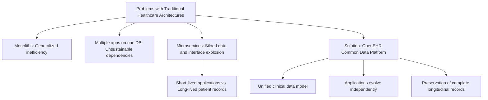

# The Problem that OpenEHR Solves

## 1. Introduction

In this module, we explore the inherent issues within traditional software architectures used in healthcare and understand why many widely adopted technologies fall short. This understanding sets the stage for appreciating how OpenEHR fundamentally addresses these challenges.

---

## 2. Problems with Traditional Architectures in Healthcare

The following table summarizes the definitions, core problems, and real-world impact of the main architectural patterns used in healthcare software systems:

| Architecture Approach | Definition | Problems | Real-World Impact |
|:----------------------|:-----------|:---------|:------------------|
| **Monolithic Systems** | One massive application managing all functionalities across specialties. | - Poor specialization. - Vendor dependency for changes. - Inefficiency. | Slow innovation and generalized low-quality across medical domains. |
| **Multiple Apps on One Database** | Several applications operating on a single shared database. | - Tight coupling. - Database migration is extremely difficult. - High maintenance risk. | Database upgrades or technology changes become cost-prohibitive. |
| **Microservices Architecture** | Each application with its own database, communicating via APIs. | - N x N integrations needed. - Data fragmentation. - Lack of unified longitudinal patient records. | Fragmented patient view, excessive integration costs, and risk of data loss over time. |

---

## 3. Real-World Example

To illustrate these challenges, the instructor shares a personal experience as a practicing doctor. There were two separate lab applications within the hospital, requiring manual data transfer each morning. Despite creating a script to automate this process, full integration was deemed too costly and complex due to vendor dependencies. This example highlights systemic inefficiencies and the practical difficulties faced in healthcare IT integration.

---

## 4. OpenEHR as a Solution

OpenEHR introduces a paradigm shift in healthcare IT:

- **Common Data Platform:** A central repository with a consistent clinical data model accessible by all applications.  
- **Benefits:**  
  - Eliminates the need for numerous point-to-point integrations by providing a single interface for all applications.  
  - Supports comprehensive longitudinal health records visible at any point of care.  
  - Decouples patient data longevity from the shorter lifecycle of individual applications, ensuring data preservation over decades.

---

## 5. Technical Challenges and Industry Attempts

Building a unified data platform is inherently complex:

- **Consistency of Concept Representation:** Different applications must represent identical clinical concepts in a standardized manner to avoid semantic discrepancies.  
- **Adaptability:** Applications should evolve independently without disrupting the shared clinical data model.  

While industry efforts such as FHIR-native databases and graph database solutions attempt to address these issues, they often struggle with the trade-offs involved. OpenEHR effectively resolves these challenges through its dual-layer architecture comprising a stable Reference Model and flexible Archetypes/Templates, enabling semantic interoperability and extensibility.

---

## 6. Visual Summary

---

## 7. Conclusion

Traditional healthcare IT architectures fail to address the long-term needs of patient-centered care. OpenEHR offers a robust, sustainable solution by providing a centralized, semantically rich data platform that separates patient information from the technological volatility of individual applications. This innovation enables truly longitudinal, interoperable, and adaptable healthcare records for the future.

---