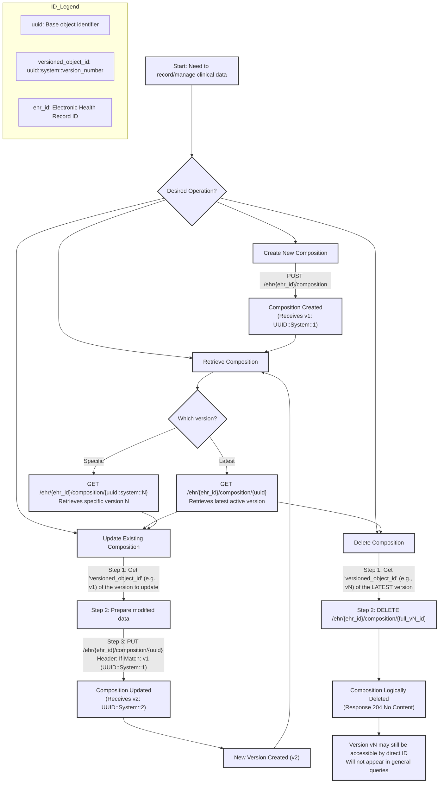

# Module 2: Managing Compositions: Retrieval, Updates, Versioning, and Deletion

## Visual Summary: Composition Management Flowchart

This guide explains how to retrieve, update, manage versions of, and delete openEHR compositions using the EHRbase REST API, typically via a tool like Postman, as demonstrated in the bootcamp.

## 1. Retrieving Compositions (Latest Version)

After a composition has been created (as covered in `module-2-01-creating-compositions-api.md`), you can retrieve it using its unique identifier.

### Key Concepts:

*   **Composition UID**: When a composition is successfully posted to the EHRbase server, the response includes a `uid` (or `versioned_object_id` for the specific version). This UID is crucial for retrieving or updating the composition.
*   **Versioned Object ID**: This ID has three parts:
    1.  **Object ID (UUID)**: The unique identifier for the composition itself (e.g., `xxxxxxxx-xxxx-xxxx-xxxx-xxxxxxxxxxxx`). This is the part you use when you want to refer to the latest version of the object.
    2.  **Creating System ID**: Identifies the system that created this version (e.g., `local.ehrbase.org`).
    3.  **Version Number**: An integer indicating the version of the composition (e.g., `1`, `2`).
    The full `versioned_object_id` looks like: `[UUID]::[Creating System ID]::[Version]`.

### API Endpoint for Retrieving the Latest Version:

*   `GET /rest/openehr/v1/ehr/{ehr_id}/composition/{composition_uid}`
    *   `{ehr_id}`: The ID of the EHR containing the composition.
    *   `{composition_uid}`: The UUID part (the object ID itself, not the full versioned ID) of the composition's `versioned_object_id`.

### Steps to Retrieve a Composition (e.g., in Postman):

1.  **Obtain the Composition UID**: After creating a composition, copy the UUID from the response (usually found at the end of the `versioned_object_id` string, before `::local.ehrbase.org::1`).
2.  **Set up the Request**:
    *   Method: `GET`
    *   URL: `https://openehr-bootcamp.medblocks.com/ehrbase/rest/openehr/v1/ehr/{your_ehr_id}/composition/{composition_uuid_copied_in_step_1}`
3.  **Specify `Accept` Header for Desired Format**:
    You can retrieve the composition in various formats by setting the `Accept` header:
    *   `application/json`: For Canonical JSON.
    *   `application/xml`: For Canonical XML.
    *   `application/openehr.wt.flat+json`: For Flat JSON (if using a Web Template).
    *   `application/openehr.wt.structured+json`: For Structured JSON (if using a Web Template).
    The system stores the data in a standard openEHR format, and these are just different serialization options. You are not losing data by posting in one format and retrieving in another.

**Example**:
If you posted a composition and got `xxxxxxxx-xxxx-xxxx-xxxx-xxxxxxxxxxxx::local.ehrbase.org::1`, you would use `xxxxxxxx-xxxx-xxxx-xxxx-xxxxxxxxxxxx` as the `{composition_uid}` in the GET request.

## 2. Updating Compositions

Existing compositions can be updated. OpenEHR handles this by creating a new version of the composition, preserving the history.

### Key Concepts:

*   **Preceding Version UID**: To update a composition, you MUST provide the complete `versioned_object_id` of the *specific version* you intend to update. This is used in the `If-Match` header.
*   **Versioning**: Each update creates a new version of the composition (e.g., version 1 becomes version 2, version 2 becomes version 3, and so on). All previous versions are retained.

### API Endpoint for Update:

*   `PUT /rest/openehr/v1/ehr/{ehr_id}/composition/{object_id}`
    *   `{ehr_id}`: The ID of the EHR.
    *   `{object_id}`: The UUID part of the composition's `versioned_object_id` (the object ID itself, not the full versioned ID).

### Headers for Update:

*   `Content-Type`: Must match the format of the composition data you are sending in the request body (e.g., `application/openehr.wt.flat+json`, `application/json`, `application/xml`).
*   `Accept`: Specifies the desired format for the response (e.g., `application/json`).
*   `If-Match`: **Crucial for updates**. This header must contain the full `versioned_object_id` of the composition version you are updating (e.g., `xxxxxxxx-xxxx-xxxx-xxxx-xxxxxxxxxxxx::local.ehrbase.org::1`).

### Steps to Update a Composition (e.g., in Postman):

1.  **Retrieve the Composition to Update (Optional but Recommended)**: First, GET the composition you want to update. This helps ensure you have the latest version and its full `versioned_object_id`.
2.  **Copy the Full `versioned_object_id`**: From the retrieved composition's metadata (e.g., in the response headers or body, often labeled `ETag` or `VERSION_UID`), copy the complete `versioned_object_id` (e.g., `xxxxxxxx-xxxx-xxxx-xxxx-xxxxxxxxxxxx::local.ehrbase.org::1`).
3.  **Prepare the Request Body**:
    *   Use the same format (Flat, Canonical JSON, XML) as the `Content-Type` header will indicate.
    *   Modify the composition data as needed (e.g., change a vital sign value).
    *   **Important**: If your request body format includes a field for the composition's UID (like `_uid` in some flat formats or a specific path in canonical formats), you might need to remove or nullify it. The system will generate the UID for the new version. The transcript specifically mentions removing the `vital_signs/uid` field when updating a flat JSON composition.
4.  **Set up the PUT Request**:
    *   Method: `PUT`
    *   URL: `https://openehr-bootcamp.medblocks.com/ehrbase/rest/openehr/v1/ehr/{your_ehr_id}/composition/{composition_uuid}` (use the UUID part only in the URL).
    *   Headers:
        *   `Content-Type`: e.g., `application/openehr.wt.flat+json`
        *   `Accept`: e.g., `application/json`
        *   `If-Match`: The full `versioned_object_id` copied in step 2.
    *   Body: The modified composition data.
5.  **Execute the Request**:
    *   A successful update will typically return a `200 OK` or `204 No Content` status, and the response headers will contain the `versioned_object_id` of the *newly created version* (e.g., `xxxxxxxx-xxxx-xxxx-xxxx-xxxxxxxxxxxx::local.ehrbase.org::2`).

**Example Workflow**:

1.  You have a composition with `versioned_object_id`: `abc-123::local.ehrbase.org::1`.
2.  To update it, you make a `PUT` request to `/rest/openehr/v1/ehr/{ehr_id}/composition/abc-123`.
3.  The `If-Match` header of this `PUT` request must be `abc-123::local.ehrbase.org::1`.
4.  The request body contains the new data for the composition.
5.  Upon success, EHRbase creates a new version. If you retrieve `abc-123` again, you'll get version 2, and its `versioned_object_id` will be `abc-123::local.ehrbase.org::2`.
6.  If you want to update it again, your next `PUT` request's `If-Match` header must be `abc-123::local.ehrbase.org::2`.

## 3. Retrieving Specific Historical Versions

You can retrieve a specific historical version of a composition if you know its full `versioned_object_id`. This is useful for viewing the history of changes.

### API Endpoint for Retrieving a Specific Version:

*   `GET /rest/openehr/v1/ehr/{ehr_id}/composition/{versioned_composition_id}`
    *   `{ehr_id}`: The ID of the EHR.
    *   `{versioned_composition_id}`: This is the **full** versioned ID of the composition, including the UUID, creating system, and version number (e.g., `xxxxxxxx-xxxx-xxxx-xxxx-xxxxxxxxxxxx::local.ehrbase.org::1`).

### Steps to Retrieve a Specific Version:

1.  **Identify the `versioned_object_id`**: You need the complete `versioned_object_id` of the specific version you want to retrieve. For example, if you updated a composition from version 1 to version 2, and then to version 3, you can retrieve version 1, 2, or 3 by using their respective full `versioned_object_id`s.
2.  **Set up the GET Request**:
    *   Method: `GET`
    *   URL: `https://openehr-bootcamp.medblocks.com/ehrbase/rest/openehr/v1/ehr/{your_ehr_id}/composition/{full_versioned_composition_id_from_step_1}`
    *   Headers: Specify the `Accept` header for the desired format (e.g., `application/openehr.wt.flat+json`, `application/json`).

**Example**:
To retrieve version 1 of a composition whose `versioned_object_id` is `abc-123::local.ehrbase.org::1`, you would use that full string as the `{versioned_composition_id}` in the GET request. To get version 2 (`abc-123::local.ehrbase.org::2`), you would use that specific versioned ID.

This allows you to access the historical state of the composition. All versions are preserved in the system by default, providing a full audit trail of changes.

## 4. Deleting Compositions

Compositions can be deleted from the EHR. The openEHR REST API specifies deletion using the `preceding_version_uid`.

### Key Concepts for Deletion:

*   **Preceding Version UID**: To delete a composition, you MUST provide the complete `versioned_object_id` of the *latest existing version* of the composition.
*   **Effect of Deletion**: After deletion, the composition will no longer be retrievable through queries that fetch the latest version (e.g., AQL queries or GET requests using only the base UUID). However, the specific version that was marked for deletion (and potentially its history) might still be accessible if queried directly by its full `versioned_object_id`, though it's effectively removed from the active record.

### API Endpoint for Deletion:

*   `DELETE /rest/openehr/v1/ehr/{ehr_id}/composition/{preceding_version_uid}`
    *   `{ehr_id}`: The ID of the EHR.
    *   `{preceding_version_uid}`: The **full** `versioned_object_id` of the latest version of the composition to be deleted (e.g., `xxxxxxxx-xxxx-xxxx-xxxx-xxxxxxxxxxxx::local.ehrbase.org::3`).

### Steps to Delete a Composition (e.g., in Postman):

1.  **Identify the `versioned_object_id` of the Latest Version**: Ensure you have the complete `versioned_object_id` of the most recent version of the composition you intend to delete. If the composition is at version 3, you need the versioned ID for version 3.
2.  **Set up the DELETE Request**:
    *   Method: `DELETE`
    *   URL: `https://openehr-bootcamp.medblocks.com/ehrbase/rest/openehr/v1/ehr/{your_ehr_id}/composition/{full_versioned_object_id_of_latest_version}`
    *   Headers: No specific `Content-Type` or `If-Match` is typically required for the DELETE operation itself, but ensure your Postman setup or client sends appropriate default headers if needed.
3.  **Execute the Request**:
    *   A successful deletion will typically return a `204 No Content` status.

**Behavior After Deletion**:

*   If you attempt to `GET` the composition using just its base UUID (e.g., `/rest/openehr/v1/ehr/{ehr_id}/composition/{uuid}`), you should receive a `204 No Content` or a `404 Not Found`, indicating it's no longer considered an active/latest composition.
*   AQL queries will generally no longer return this deleted composition.
*   As per the transcript, attempting to `GET` the specific `versioned_object_id` that was deleted might still return that version's data, but it's logically deleted from the main record.

**Important Note on Deletion vs. Audit**: While the API allows deletion, in many healthcare scenarios, true deletion is discouraged. Instead, compositions might be marked as erroneous or amended, preserving the full audit trail. The openEHR specification supports robust versioning, which is key for this. Deletion should be used with caution and understanding of its implications on data integrity and auditability.

This documentation should help you understand the processes of retrieving, updating, managing versions of, and deleting compositions as discussed in the bootcamp sessions.
