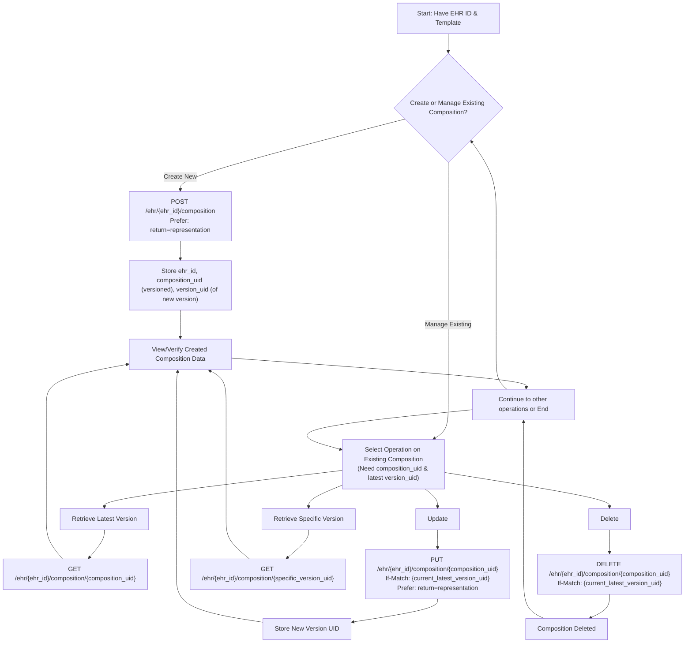
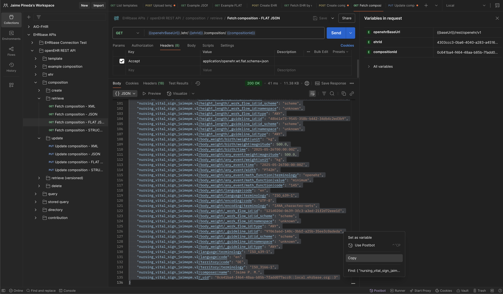
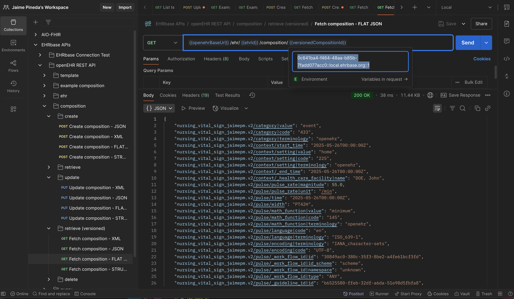
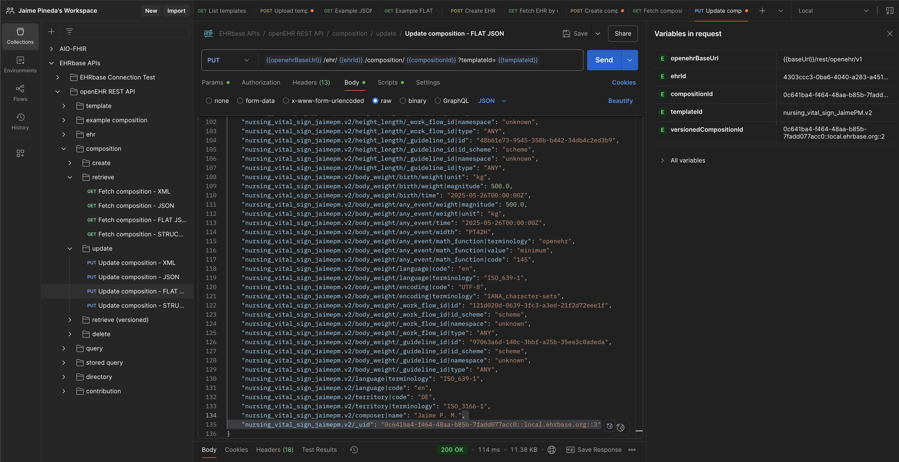
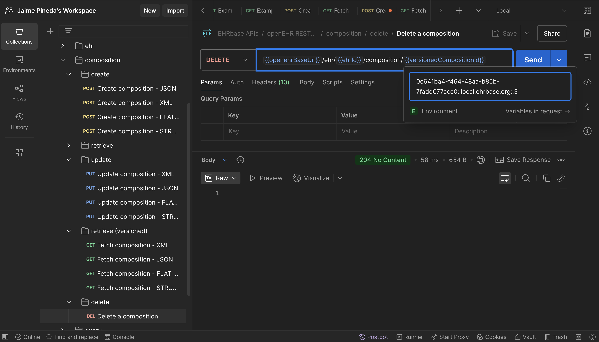

# Module 2: Managing EHR Compositions (CRUD & Versioning)

This guide provides a comprehensive overview of creating, retrieving, updating, deleting (CRUD), and versioning openEHR compositions using the REST API. It aligns with the practical exercises in Module 2 and the bootcamp's Postman collection.

## Visual Summary: Composition Management Workflow



## Introduction

Managing clinical data often involves the full lifecycle of operations on a composition. This includes creating new entries, reading existing ones, updating them with new information, and occasionally deleting them. OpenEHR provides robust mechanisms for these operations, including strong version control.

**Core Principle for Module 2**: Focus on the practical mechanics. If you can perform an operation in Postman using the bootcamp collection, you have the blueprint for your Svelte application. The official API specifications are for deeper understanding when needed.

## Step 0: Prerequisite - Creating an EHR

Before any compositions can be stored, an Electronic Health Record (EHR) must exist for the patient. This is typically a one-time operation per patient.

### API Call: Create EHR
- **Endpoint**: `POST /rest/openehr/v1/ehr`
- **Method**: `POST`
- **Headers**:
    - `Content-Type: application/json`
    - `Accept: application/json`
- **Body**: Empty (The EHR ID is auto-generated by the server)
- **Success Response (201 Created)**:
  ```json
  {
    "ehr_id": {
      "value": "generated-ehr-id-uuid"
    },
    "system_id": { "value": "ehrbase-system-id" },
    "time_created": { "value": "timestamp" }
  }
  ```
- **Action**: Securely store the `ehr_id.value`. This ID is essential for all subsequent operations related to this patient's record. In Postman, this is often saved as an environment variable (e.g., `{{ehr_id}}`).

## Step 1: Creating a Composition (POST)

Once an EHR exists, you can post clinical compositions to it. This example uses the vital signs template from Module 1.

### API Call: Create Composition
- **Endpoint**: `POST /rest/openehr/v1/ehr/{ehr_id}/composition`
    - Replace `{ehr_id}` with the actual ID obtained in Step 0.
- **Method**: `POST`
- **Headers**:
    - `Content-Type: application/json` (Your request body is JSON)
    - `Accept: application/json` (You expect a JSON response)
    - `Prefer: return=representation` (Instructs the server to return the full created composition in the response. Use `return=minimal` for just a confirmation, which is often better in production but less informative during development.)
- **Body**: The full composition data in canonical JSON format, based on your template (e.g., `JaimePM_vital_signs.v0.opt`).
    - Key fields to customize in your JSON body: composer name, context times, and actual clinical values.
    - **Note on Content Types**: While this guide focuses on `Content-Type: application/json` (for canonical JSON, where the template ID is *within* the composition), if you were to post compositions using Web Template-derived formats (e.g., `application/openehr.wt.flat+json`), you would also need to include a `templateId` query parameter in the endpoint URL (e.g., `POST /rest/openehr/v1/ehr/{ehr_id}/composition?templateId=your_template_id`). The Postman collection may demonstrate this for specific request types.
- **Success Response (201 Created)**:
    - The server returns the full composition, now including system-assigned UIDs.
    - **Key values to note from the response headers or body**:
        - `ETag` or `Location` header: Contains the `version_uid` of the newly created composition. This is often in the format `{versioned_object_uid}::{host_system_id}::{version_tree_id}` (e.g., `xxxxxxxx-xxxx-xxxx-xxxx-xxxxxxxxxxxx::ehrbase.org::1`).
        - `composition_uid` (or `versioned_object_uid`): The base UID for this composition, which remains the same across versions. This is part of the `version_uid`.
- **Action**:
    - Store the `ehr_id`.
    - Store the `composition_uid` (the version-independent part, e.g., `xxxxxxxx-xxxx-xxxx-xxxx-xxxxxxxxxxxx`). Postman might save this as `{{composition_uid}}`.
    - Store the full `version_uid` of this initial version (e.g., `xxxxxxxx-xxxx-xxxx-xxxx-xxxxxxxxxxxx::ehrbase.org::1`). Postman might save this as `{{preceding_version_uid}}` or `{{latest_version_uid}}` as it's needed for the `If-Match` header in subsequent updates or deletions.

*(Content for preparing composition data and common creation issues can be referenced from `module-2-01-creating-compositions-api.md` or integrated here if desired for full consolidation.)*

## Step 2: Retrieving Compositions (GET)

You can retrieve the latest version of a composition or a specific historical version.

### 2.1 Retrieving the Latest Version

- **Endpoint**: `GET /rest/openehr/v1/ehr/{ehr_id}/composition/{versioned_object_uid}`
    - `{versioned_object_uid}`: The base UID of the composition (e.g., the `{{composition_uid}}` captured earlier).
- **Method**: `GET`
- **Headers**:
    - `Accept: application/json`
- **Success Response (200 OK)**: The full JSON representation of the latest version of the composition. The `ETag` header will contain its specific `version_uid`.


### 2.2 Retrieving a Specific Historical Version

- **Endpoint**: `GET /rest/openehr/v1/ehr/{ehr_id}/composition/{version_uid}`
    - `{version_uid}`: The complete, version-specific UID (e.g., `xxxxxxxx-xxxx-xxxx-xxxx-xxxxxxxxxxxx::ehrbase.org::1`).
- **Method**: `GET`
- **Headers**:
    - `Accept: application/json`
- **Success Response (200 OK)**: The JSON representation of that specific version of the composition.


## Step 3: Updating a Composition (PUT)

Updating a composition creates a new version; it doesn't alter existing versions. This requires optimistic locking using the `If-Match` header.

### API Call: Update Composition
- **Endpoint**: `PUT /rest/openehr/v1/ehr/{ehr_id}/composition/{versioned_object_uid}`
    - `{versioned_object_uid}`: The base UID of the composition you are updating.
- **Method**: `PUT`
- **Headers**:
    - `Content-Type: application/json`
    - `Accept: application/json`
    - `If-Match: {current_latest_version_uid}` (CRITICAL: This must be the `version_uid` of the most recent version of the composition you intend to update. E.g., the `{{preceding_version_uid}}` or `{{latest_version_uid}}` from Postman. This prevents unintended overwrites if the composition was changed by someone else since you last fetched it.)
    - `Prefer: return=representation` (To get the updated composition back. `return=minimal` for just confirmation.)
- **Body**: The *entire* new version of the composition data in JSON format.
- **Success Response (200 OK)**:
    - The server returns the new version of the composition.
    - The `ETag` or `Location` header will contain the new `version_uid` for this updated version.
- **Action**: Update your stored `latest_version_uid` (e.g., `{{preceding_version_uid}}` in Postman) to this new `version_uid`.



## Step 4: Deleting a Composition (DELETE)

Deleting a composition also requires optimistic locking via the `If-Match` header. This typically marks the composition as deleted rather than physically removing it, preserving audit trails.

### API Call: Delete Composition
- **Endpoint**: `DELETE /rest/openehr/v1/ehr/{ehr_id}/composition/{versioned_object_uid}`
    - `{versioned_object_uid}`: The base UID of the composition to be deleted.
- **Method**: `DELETE`
- **Headers**:
    - `Accept: application/json` (Though often no body is returned on success)
    - `If-Match: {current_latest_version_uid}` (CRITICAL: This must be the `version_uid` of the most recent version of the composition. This ensures you are deleting the version you intend to.)
- **Success Response (204 No Content)**: Indicates successful deletion. No response body.

## Key HTTP Headers for Composition Management

- **`Content-Type: application/json`**: Specifies that the request body (for POST, PUT) is in JSON format. Essential.
- **`Accept: application/json`**: Informs the server that the client expects the response in JSON format. Essential.
While the openEHR REST API supports various content types (e.g., XML, different JSON flavors like Flat or Structured derived from Web Templates), this bootcamp primarily focuses on `application/json` for canonical JSON exchanges. The `Content-Type` and `Accept` headers are crucial for negotiating these formats with the server if you explore alternatives.
- **`If-Match: {version_uid}`**: Used for optimistic concurrency control in `PUT` and `DELETE` operations. It ensures that the operation is performed only if the client\'s version of the resource matches the server\'s current version, preventing lost updates or accidental deletions on stale data. The value is the `version_uid` of the composition version being targeted for update/delete.
- **`Prefer: return=representation | return=minimal`**:
    - `return=representation`: Requests the server to return the full resource representation after a successful `POST` or `PUT`. Useful during development and learning.
    - `return=minimal`: Requests minimal confirmation (e.g., just headers or a success status). More efficient for production.

## Understanding Key Identifiers

- **`ehr_id`**: The unique identifier for a patient's Electronic Health Record.
- **`versioned_object_uid` (or `composition_uid` in Postman variables)**: The persistent, version-independent identifier for a composition (e.g., `xxxxxxxx-xxxx-xxxx-xxxx-xxxxxxxxxxxx`). This ID is used in the path for GET (latest), PUT, and DELETE operations.
- **`version_uid` (or `object_version_id`, often stored as `preceding_version_uid` or `latest_version_uid` in Postman)**: The unique identifier for a *specific version* of a composition (e.g., `xxxxxxxx-xxxx-xxxx-xxxx-xxxxxxxxxxxx::ehrbase.org::1`). This is used in the `If-Match` header for PUT/DELETE operations and in the path for GETting a specific version.

## Postman and Practical Application

The bootcamp's Postman collection (`openEHR APIs.postman_collection.json`) provides working examples of these calls. Pay attention to how:
- Environment variables like `{{ehr_id}}`, `{{composition_uid}}`, and `{{preceding_version_uid}}` (or a similar name for the latest version UID) are used to chain requests.
- The "Tests" tab in Postman requests is often used to capture these UIDs from responses and set them as environment variables for subsequent calls.

This workflow—creating an EHR, then creating and managing compositions—is fundamental to building openEHR applications.

## Common Issues and Troubleshooting

- **`400 Bad Request`**: Often due to malformed JSON in the request body or incorrect data types not matching the template.
- **`401 Unauthorized`**: Authentication details are missing or incorrect.
- **`404 Not Found`**: The specified `ehr_id` or `composition_uid` does not exist. Double-check your IDs.
- **`409 Conflict` / `412 Precondition Failed` (for PUT/DELETE)**: The `If-Match` header value (the `version_uid`) does not match the server's current version of the composition. This means the composition was updated by another process since you last fetched it. You'll need to retrieve the latest version and retry your update/delete with the new `version_uid`.
- **"Template not found"**: The `template_id` within your composition JSON does not match any template uploaded to the EHRbase server.
- **"Observation contains no results"**: Ensure all required data points within your composition's observations have actual values, not empty arrays or nulls where data is expected.

Refer to the API specification or EHRbase documentation for detailed error code meanings if you encounter other issues.
